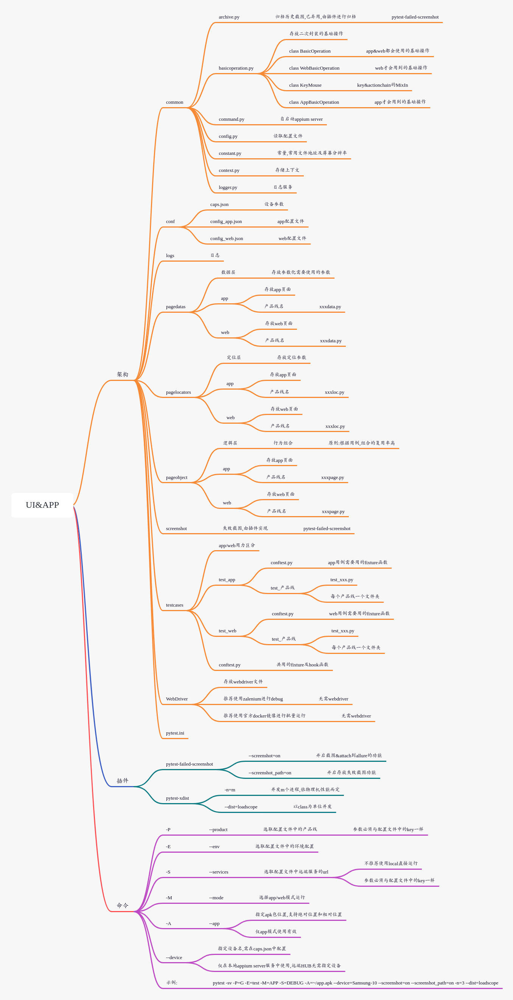

# UI&APP聚合框架

## 说明

本版本为stable版本,dev版本因调试存在敏感信息及本人原因存在较多无意义的commit记录.故在此独立项目开源stable版本.如有任何关于框架的疑问都可以提issue

## 功能说明

1. 以PageObject的思想设计框架
    - 对象层(基础操作),数据层,定位层,逻辑层,业务层.相互解耦,方便维护 结构清晰
    - 以Page为单位设计用例
2. 支持并发运行,并推荐以class级别为单位进行并发运行,降低资源开销.
3. 支持并发时进程级别共享数据(例如:某一进程进行登录操作,写入相关缓存,其他进程读取缓存并写入浏览器中,实现共享登录)
4. 支持使用`pytest-failed-screenshot`插件实现失败截图,无需每个用例处调用失败截图
5. 支持APP&WEB共用框架,方便维护,使用`-M`|`--mode`选择使用`WEB`|`APP`模式.使用后将会过滤另外一个模式的所以用例
6. 基于双模式,多产品线,多环境配置化,方便维护配置,也方便多样性使用
    - 命令参数:`-P`|`--product` 选择产品线,传参必须与配置文件中key一致
    - 命令参数:`-E`|`--env` 选择产品线中的环境,传参必须与配置文件中key一致
    - 命令参数:`-S`|`--services`  选择需要运行的远端服务,WEB推荐使用zalenium进行DEBUG,而不是使用local serve

7. 结合zalenium,可以录屏状态标记和实时预览,推荐使用其作为debug使用.

## 目录结构&介绍



## 用例设计
1. 用例以page为单位进行设计
2. 共用的fixture及hook函数放在外层conftest文件
3. 多个page共用的fixture放在模块(如:test_web)conftest文件内
4. 用例以class为单位并发设计
5. 推荐class级别的前置实例化webdriver,降低资源开销
6. class内每个用例需要清除状态的可以在页面内单独使用`function`级别的fixture进行刷新等操作
7. 使用`pytest-ordering`插件,将会发生页面变化的后置`pytest.mark.run(order=-1)`,
   如有多个用例都会对页面产生变化,则应通过fixture函数解决

   
```python
import pytest


@pytest.fixture()  # func级别前置,每次运行完都刷新,清除状态
def setup(setup_login):
    yield setup_login
    setup_login.refresh()


class TestMyOrder:

    # 测试登录失败
    def test_1(self, setup):
        pass

    # 测试登录成功
    @pytest.mark.run(order=-1)  # 若登录成功先执行,将导致登录失败用例无法执行,在编写用例时需注意
    def test_2(self, setup):
        pass
```


## 配置介绍


WEB:config_web.json
- B: 业务线/产品线名, 与`-P`传参需一致
   - services: selenium服务, `-S`传参需一致
   - env: 环境, `-E`传参需一致
      - init: 初始化参数,可用来存放共享登录使用的数据
      - log: 日志配置
```json
{
  "B": {
    "product": "baidu",
    "services": {
      "DEBUG": "http://localhost:4444/wd/hub",
      "LOCAL": "D:\\uiautotest\\WebDriver\\chromedriver.exe"
    },
    "env": {
      "test": {
        "init": {
          "web_user": "account",
          "web_password": "password"
        },
        "service": {
          "web": "https://image.baidu.com/"
        },
        "log": {
          "logger_level": "DEBUG",
          "stream_level": "DEBUG",
          "file_level": "INFO",
          "file_level_rf": "INFO"
        }
      },
      "dev": {
        "service": {
          "web": "https://image.baidu.com/"
        },
        "log": {
          "logger_level": "DEBUG",
          "stream_level": "DEBUG",
          "file_level": "INFO",
          "file_level_rf": "INFO"
        }
      }
    }
  }
}
```
APP:config_app.json
- G: 业务线/产品线名, 与`-P`传参需一致
    - product: 产品线真实名字,必须与testcases中产品线文件夹名相同 
    - services: appium服务, `-S`传参需一致
    - caps: 初始化服务配置,存放当前产品必须的参数
    - env: 环境, `-E`传参需一致
      - log: 日志配置
      - mysql: 数据库配置
```json
{
  "G": {
    "product": "baidu",
    "services": {
      "DEBUG": "http://localhost:4723/wd/hub",
      "HUB": "http://172.16.16.84:5555/wd/hub"
    },
    "caps": {
      "appPackage": "com.GotoCash",
      "appActivity": "com.GotoCash.MainActivity",
      "platformName": "Android",
      "noReset": false,
      "uiautomator2ServerReadTimeout": 480000,
      "newCommandTimeout": 120,
      "autoGrantPermissions": true
    },
    "env": {
      "dev": {
        "log": {
          "logger_level": "DEBUG",
          "stream_level": "DEBUG",
          "file_level": "INFO",
          "file_level_rf": "INFO"
        },
        "mysql": {
          "host": "172.16.0.30",
          "port": "3306",
          "user": "user",
          "password": "password"
        }
      },
      "test": {
        "log": {
          "logger_level": "DEBUG",
          "stream_level": "DEBUG",
          "file_level": "INFO",
          "file_level_rf": "INFO"
        },
        "mysql": {
          "host": "172.16.0.40",
          "port": "3306",
          "user": "user",
          "password": "password"
        }
      }
    }
  }
}
```

CAPS:caps.json
- devices: 存放每台设备的配置参数
    - 设备名: 该名用于`--device=Emulator`指定设备使用
```json
{
  "devices": {
    "Emulator": {
      "platformName": "Android",
      "platformVersion": "7.1.2",
      "deviceName": "Emulator",
      "automationName": "UiAutomator2"
    },
    "honor-9i": {
      "platformName": "Android",
      "platformVersion": "9",
      "deviceName": "37KRX19215004084",
      "automationName": "UiAutomator2"
    }
  }
}

```


## 共享数据

```python
import json
import pytest
from filelock import FileLock


@pytest.fixture(scope="class")
def setup_login(driver, worker_id, tmp_path_factory):
    # -----> 使用者仅需修改此处需要使用的初始化数据即可
    init = getattr(Context, "ENV")["init"]
    account = init["web_user"]
    pwd = init["web_password"]
    # <----------------------------

    if worker_id == "master":  # 当不开启并发模式时

        # -----> 使用者仅需修改此处登录函数即可
        lp = LoginPage(driver)  # 可以直接调用登录逻辑层
        lp.send_code(account, pwd)
    # <-------------------------------

    else:
        root_tmp_dir = tmp_path_factory.getbasetemp().parent
        fn = root_tmp_dir / "data.json"
        with FileLock(str(fn) + ".lock", timeout=20):
            if fn.is_file():
                token = json.loads(fn.read_text())

                # -------> 使用者仅需修改此处,此处示例是读取文件中数据设置为浏览器缓存,从而绕过登录
                for k, y in token.items():
                    setattr(Context, k, y)
                WebBasicOperation(driver).set_all_storage(**token)
                # <------------------------

                driver.refresh()
            else:

                # -------------> 使用者仅需修改此处,此处通过调用登录逻辑层,实现登录并将浏览器缓存数据写入文件
                lp = LoginPage(driver)
                lp.send_code(account, pwd)
                MyOrderPage(driver).get_my_order_title  # 防止过快拿缓存 等确定跳转到成功页面再拿
                token = lp.get_all_storage()
                # <----------------------------------------

                fn.write_text(json.dumps(token))
    yield driver
```

## 更新日志

### v1.0.0
Release